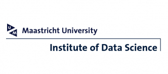
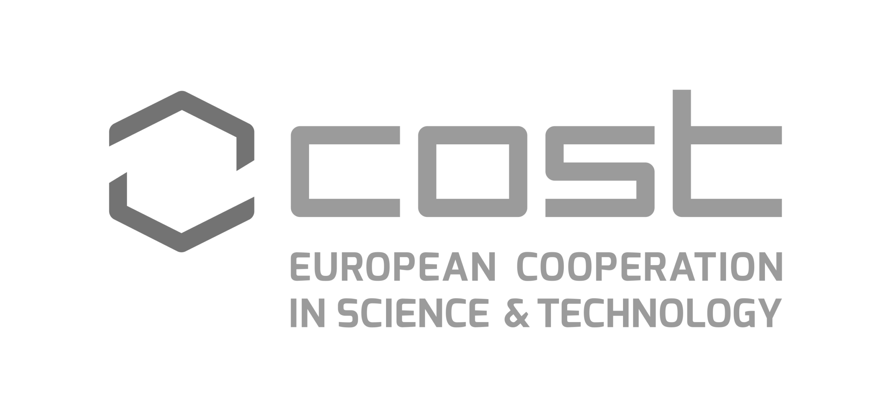

# 🥗 KG for food: towards a nutrition information Knowledge Graph
A RDF Knowledge Graph for relevant information of food _e.g. Food CompositionData_.

## Objective

We will explore how food prices impose an insurmountable barrier to improve diet quality. Using domain specific ontology e.g. FoodOn ontology or ISO-FOOD ontology, we will work on the harmonisation and integration of multi-lingual FCD that will serve as inputs for a recommendation system based on KG, which integrate multiple food price data sources e.g. WFP to enrich semantic information. The ultimate goal is to produce a KG with more comprehensive nutrition and food price information to monitor change in food price for nutrition and analyse change in cost affordability of healthy diets.

---

## Methodology

---
### Acknowledgement

This project is based upon work from COST Action "Distributed Knowledge Graphs", supported by COST (European Cooperation in Science and Technology).

COST (European Cooperation in Science and Technology) is a funding agency for research and innovation networks. Our Actions help connect research initiatives
across Europe and enable scientists to grow their ideas by sharing them with their peers. This boosts their research, career and innovation.

 [https://www.cost.eu](https://www.cost.eu).

 <a href="https://www.cost.eu/actions/CA19134/">

This research received funding from COST Action CA19134 “Distributed Knowledge Graphs” [Website: https://www.cost.eu/actions/CA19134/](https://www.cost.eu/actions/CA19134/).
## License

**Copyright (C) 2022**

MIT License 

---

